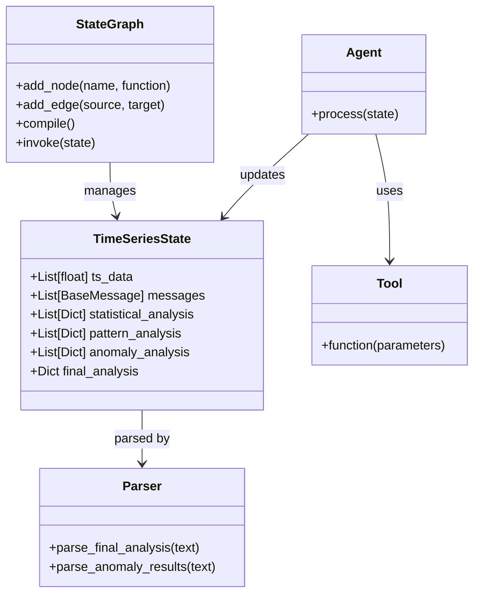

# Federated Sentinel Architecture

This document describes the architecture and design of the Federated Sentinel library for time series anomaly detection using multiple LLM agents.

## Architecture Overview

Federated Sentinel uses a multi-agent approach based on parallel branch execution. The system consists of:

1. Multiple specialized LLM agents that analyze time series data
2. A supervisor agent that coordinates the workflow and aggregates results
3. A set of tools for data analysis and visualization
4. A graph-based workflow system to manage execution


## Key Components

### State Definition

The `TimeSeriesState` defines the structure of data passed between agents:

```python
class TimeSeriesState(TypedDict):
    # Original time series data
    ts_data: List[float]
    # Messages being passed between agents
    messages: List[BaseMessage]
    # Statistical analysis results (appended by agents)
    statistical_analysis: Annotated[List[Dict[str, Any]], operator.add]
    # Pattern detection results (appended by agents)
    pattern_analysis: Annotated[List[Dict[str, Any]], operator.add]
    # Anomaly detection results (appended by agents)
    anomaly_analysis: Annotated[List[Dict[str, Any]], operator.add]
    # Final aggregated analysis
    final_analysis: Optional[Dict[str, Any]]
```

### Agent Types

1. **Supervisor Agent**
   - Coordinates workflow execution
   - Decides which agents to invoke
   - Aggregates results from specialized agents
   - Produces final analysis

2. **Statistical Analyst Agent**
   - Calculates basic statistics (mean, median, std, etc.)
   - Analyzes trends and stationarity
   - Identifies data distribution characteristics

3. **Pattern Detector Agent**
   - Identifies patterns, cycles, and seasonality
   - Detects trend changes and regime shifts
   - Analyzes periodicity and recurring motifs

4. **Anomaly Detector Agent**
   - Identifies point anomalies (spikes, dips)
   - Detects contextual anomalies
   - Finds collective anomalies (sequences)

5. **Advanced Anomaly Detector Agent**
   - Uses ensemble methods for anomaly detection
   - Provides confidence scores for detected anomalies
   - Analyzes context around anomalies for better interpretation

### Tools

1. **Visualization Tools**
   - `ts2img`: Create basic time series visualizations
   - `ts2img_with_anomalies`: Highlight anomalies in visualizations
   - `ts2img_multi_view`: Create multi-window views of time series

2. **Statistical Tools**
   - `basic_statistics`: Calculate fundamental statistics
   - `trend_analysis`: Analyze trends in time series
   - `seasonality_analysis`: Detect seasonal patterns
   - `stationarity_test`: Check for stationarity
   - `anomaly_detection`: Detect anomalies using statistical methods

3. **Math Tools**
   - `calculate`: Perform mathematical calculations via LLM
   - `rolling_window_stats`: Calculate statistics using rolling windows

4. **Time Series Utility Tools**
   - `detect_anomalies_z_score`: Z-score based anomaly detection
   - `detect_anomalies_iqr`: IQR based anomaly detection
   - `detect_anomalies_moving_average`: Moving average based detection
   - `detect_anomalies_ensemble`: Combined detection methods

### Workflow System

The workflow is managed through a graph-based execution system:

1. **Initialization**
   - Create the state graph with `TimeSeriesState`
   - Define nodes for each agent
   - Define edges for workflow transitions

2. **Execution Flow**
   - Start → Supervisor (initial assessment)
   - Supervisor → Specialized Agents (parallel execution)
   - Specialized Agents → Supervisor (results aggregation)
   - Supervisor → END (final analysis)

3. **Result Processing**
   - Parse and structure analysis results
   - Generate visualizations of detected anomalies
   - Provide confidence scores and interpretations

## Class Relationships



## Data Flow

```
[Time Series Data] → [Initial State] → [Supervisor]
                                         ↓
       ┌─────────────────────────────────┼─────────────────────────────┐
       ↓                                 ↓                             ↓
[Statistical Analyzer]            [Pattern Detector]           [Anomaly Detector]
       ↓                                 ↓                             ↓
       └─────────────────────────────────┼─────────────────────────────┘
                                         ↓
                                    [Supervisor]
                                         ↓
                                 [Final Analysis]
```

## Design Principles

1. **Specialization**: Each agent focuses on a specific aspect of time series analysis.
2. **Parallel Execution**: Agents run concurrently for efficiency.
3. **Comprehensive Analysis**: Multiple methods are used for more robust results.
4. **Interpretability**: Results include explanations and confidence measures.
5. **Extensibility**: System can be extended with new agents and tools.

## Implementation Notes

1. Each agent is implemented as a function that takes and returns a state.
2. Tools are implemented as decorated functions that can be called by agents.
3. The workflow is defined using a directed graph with nodes and edges.
4. Results are parsed and structured for better interpretation.

## Future Extensions

1. **Additional Agent Types**:
   - Forecasting agent for prediction
   - Root cause analysis agent
   - Decision recommendation agent

2. **Enhanced Tools**:
   - More advanced visualization options
   - Integration with external data sources
   - Support for multivariate time series

3. **System Improvements**:
   - Caching for repeated analyses
   - Dynamic agent selection based on data characteristics
   - Adaptive threshold selection for anomaly detection